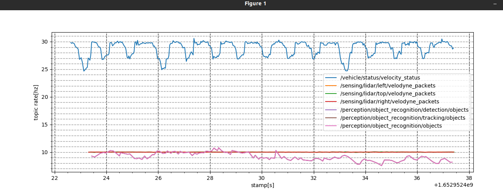

# rosbag_hz_visualizer

## How to run

```
source install/setup.bash
python3 scripts/hz_visualizer.py /path_to_bagfile
```



## Example setting in rosbag_hz_visualizer.py

```
        self.topic_names = [
            '/vehicle/status/velocity_status',
            '/sensing/lidar/left/velodyne_packets',
            '/sensing/lidar/top/velodyne_packets',
            '/sensing/lidar/right/velodyne_packets',
            '/perception/object_recognition/detection/objects',
            '/perception/object_recognition/tracking/objects',
            '/perception/object_recognition/objects',
        ]
```
